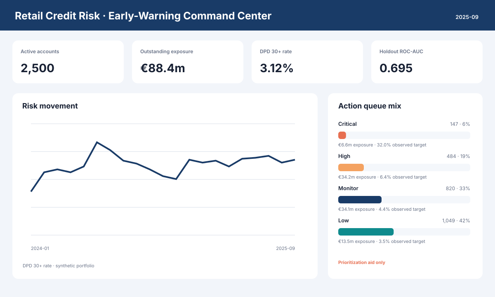

# Retail Credit Risk Early-Warning Analytics

An end-to-end retail-banking analytics case study that turns monthly account behavior into an
auditable early-warning review queue. The repository demonstrates the work expected of a data
analyst in a credit-risk team: data generation and controls, dimensional SQL, portfolio KPIs,
delinquency analysis, interpretable modeling, executive reporting, and a Streamlit command center.

> **Truth-in-portfolio statement:** every customer, account, balance, signal, and outcome in this
> repository is synthetic. The reported metrics demonstrate analytical technique; they are not
> evidence of performance at a real bank and must not be represented as such.

## Business question

A retail bank wants to identify existing accounts showing early signs of financial stress so its
portfolio team can prioritize manual review and supportive outreach before severe delinquency.
The analytical product must answer:

- Where are arrears, exposure, and forward risk moving?
- Which products and accounts need attention first?
- Which observable behaviors explain the ranking?
- How can the workflow be reproduced, validated, and governed?

## Decision product

| Consumer | Decision supported | Refresh | Output |
| --- | --- | --- | --- |
| Credit-risk manager | Monitor risk movement and concentration | Monthly | KPI dashboard and executive memo |
| Portfolio analyst | Prioritize accounts for human review | Monthly | Ranked action queue with reason indicators |
| Model-risk reviewer | Challenge method, leakage, calibration, and scope | Per release | Model card, coefficients, temporal metrics |
| Data engineer / analyst | Reproduce and reconcile the pipeline | On demand | Seeded files, SQLite layer, tests, CI |

The score is a **review-prioritization aid only**. It is not designed or authorized for approval,
pricing, credit-limit, collections-treatment, or adverse-action decisions.

## Generated portfolio and holdout result

The checked-in artifacts were produced with seed **42**, **2,500 loans**, and **21 monthly
snapshots**.

| Measure | Result |
| --- | ---: |
| Synthetic monthly snapshots | 52,500 |
| Latest outstanding exposure | €88.4m |
| Latest DPD 30+ rate | 3.12% |
| Purged holdout ROC-AUC | 0.695 |
| Holdout average precision | 0.253 |
| Holdout Brier score | 0.049 |
| Holdout top-decile recall | 37.6% |
| Holdout top-decile lift | 3.08× |

Read these as **workflow checks on a designed synthetic signal**, not production claims. Details
and limitations are in [the generated model card](reports/model_card.md).

## End-to-end architecture

~~~mermaid
flowchart LR
    A["Seeded synthetic source generator"] --> B["CSV source layer"]
    B --> C["Validated SQLite ETL"]
    C --> D["SQL views and portfolio analysis"]
    C --> E["Interpretable logistic model"]
    E --> F["Scores, metrics, coefficients"]
    D --> G["Executive report and SVG charts"]
    F --> G
    D --> H["Streamlit dashboard"]
    F --> H
    I["Unit tests and GitHub Actions"] --> A
    I --> C
    I --> E
~~~

The validation design is temporal: older observations train the model, the next three months are
embargoed, and the final three months form the holdout. The embargo matches the simulated
three-month target horizon and reduces train/holdout label-window overlap.

## Key KPIs

| KPI | Definition | Why it matters |
| --- | --- | --- |
| Outstanding exposure | Sum of month-end outstanding balances | Quantifies capital at risk |
| DPD 30+ rate | Accounts with days past due ≥ 30 / active accounts | Tracks material arrears incidence |
| DPD 90+ rate | Accounts with days past due ≥ 90 / active accounts | Tracks severe delinquency |
| Simulated 3m target rate | Synthetic forward events / eligible snapshots | Demonstrates outcome monitoring |
| Roll rate | Accounts moving from one delinquency state to another / prior state | Detects deterioration and cures |
| Top-decile recall | Holdout events found above a train-set score cutoff / holdout events | Measures queue coverage |
| Lift | Queue event rate / portfolio event rate | Measures prioritization value |
| Brier score | Mean squared probability error | Checks probability quality |

## What is inside

~~~text
.
├── app/streamlit_app.py          Interactive command center
├── artifacts/                    Model, scores, metrics, coefficients, SVG charts
├── data/
│   ├── raw/                      Seeded synthetic CSVs and provenance manifest
│   └── processed/credit_risk.db  Reproducible SQLite analytical database
├── docs/                         Architecture, dictionary, method, Notion case study
├── reports/                      Executive memo, model card, selected SQL outputs
├── scripts/                      One-command pipeline and individual stages
├── sql/                          Schema, reusable views, decision-focused SQL
├── src/credit_risk/              Generator, ETL, model, and reporting package
└── tests/                        Determinism, integrity, model, and artifact tests
~~~

## Reproduce locally

Python 3.9+ is supported. From the repository root:

~~~bash
python3 -m venv .venv
source .venv/bin/activate
python -m pip install -r requirements.txt
make pipeline
make test
make dashboard
~~~

Open the local URL printed by Streamlit. The full pipeline is deterministic for the same seed.
Override its scale with, for example:

~~~bash
make pipeline LOANS=1000 MONTHS=15 SEED=7
~~~

Individual stages are also available:

~~~bash
python scripts/generate_data.py --loans 2500 --months 21 --seed 42
python scripts/build_database.py
python scripts/run_analysis.py
~~~

## Analytical choices

- **Public-safe source:** deterministic simulation makes the repository shareable without PII or
  confidential bank data.
- **Account-month grain:** supports trend, roll-rate, exposure, and early-warning analysis.
- **SQL-first semantic layer:** joins and KPI definitions are reusable across the dashboard and
  reports.
- **Interpretable baseline:** L2-regularized logistic regression provides signed, standardized
  coefficients and probability outputs without presenting complexity as value.
- **Temporal validation:** a three-month embargo separates training and a future holdout.
- **Capacity-aware queue:** the operating point is the top-decile cutoff learned only from training
  scores; relative tiers are defined from training percentiles.
- **Governance boundary:** demographic/context columns exist for portfolio descriptions but birth
  year, region, employment, and home ownership are deliberately excluded from the model.

## SQL examples

The reusable queries in **sql/portfolio_analysis.sql** cover:

1. monthly exposure and arrears trends;
2. latest product concentration;
3. delinquency-state roll rates using window functions;
4. the model-ranked analyst queue; and
5. exposure and outcomes by relative risk tier.

Run them with any SQLite client against **data/processed/credit_risk.db**. Example:

~~~bash
sqlite3 data/processed/credit_risk.db < sql/portfolio_analysis.sql
~~~

## Automated quality checks

The test suite verifies seeded reproducibility, source constraints, row grain, referential
integrity, view availability, split boundaries, feature exclusions, score persistence, tier
coverage, report creation, and SVG validity. GitHub Actions runs the tests plus a small end-to-end
pipeline smoke test on every pull request and push to main.

~~~bash
make test
~~~

## Findings and next actions

The generated executive memo and dashboard make the latest product mix, arrears rate, relative
risk tiers, and account queue inspectable. In a real pilot, the next step would be a shadow-mode
test comparing rule-only versus model-assisted review under a fixed outreach capacity, with cure
rate, customer-support outcomes, overrides, calibration, drift, and segment stability monitored.

## Responsible-use and limitations

- The generator deliberately encodes relationships, so model performance is expected and cannot
  validate real-world effectiveness.
- Forward labels are simulated; no actual customer hardship or default is represented.
- Account snapshots are repeated over time and correlated. Confidence intervals are not reported.
- A real system needs outcome maturation, source reconciliation, drift/stability testing,
  independent validation, documented thresholds, approvals, audit logging, and monitoring.
- Fair-lending and privacy reviews must examine protected classes, proxies, reason quality,
  purpose limitation, data minimization, retention, access, explanation, and human oversight.
- Human review and customer-support safeguards remain mandatory; a model score is not a decision.

See [methodology](docs/methodology.md), [data dictionary](docs/data_dictionary.md),
[architecture](docs/architecture.md), and the [Notion-ready case study](docs/notion_case_study.md).

## Portfolio-ready talking points

- Built a deterministic synthetic retail-credit portfolio at account-month grain and loaded it
  into a constrained SQLite dimensional model.
- Defined arrears, exposure, roll-rate, ranking, lift, discrimination, and calibration measures.
- Implemented an interpretable early-warning model with a purged temporal holdout and documented
  leakage controls.
- Delivered a Streamlit action dashboard, executive reporting layer, automated tests, and CI.
- Documented honest limitations and the controls required to move from demonstration to pilot.

## License

MIT. See [LICENSE](LICENSE).
